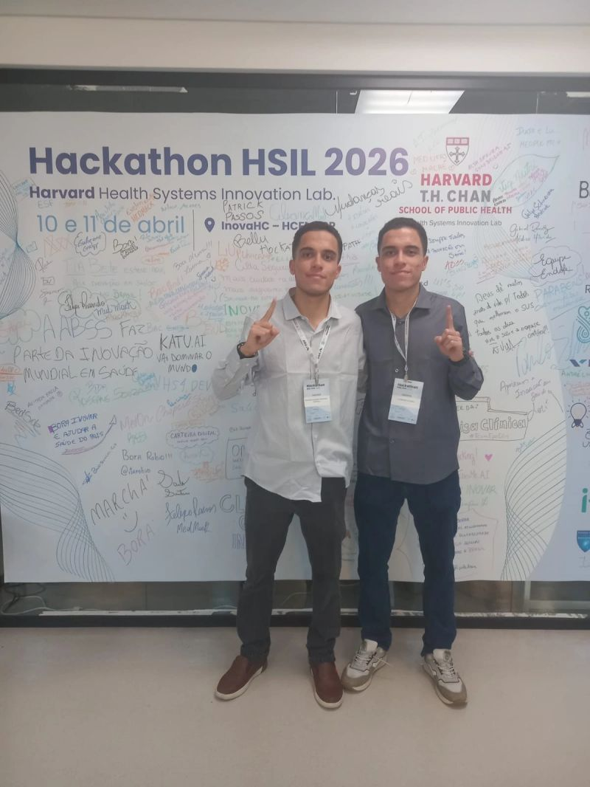
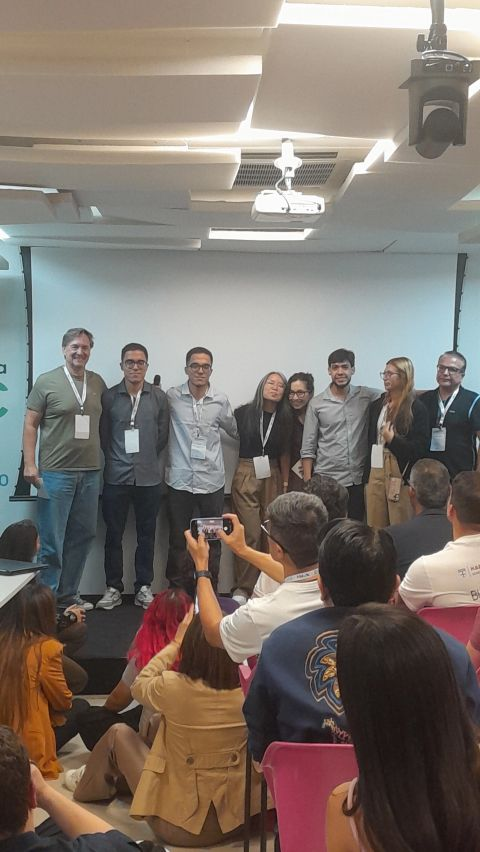
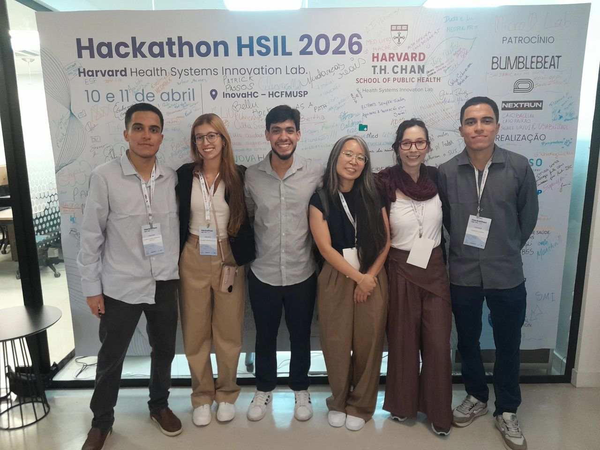
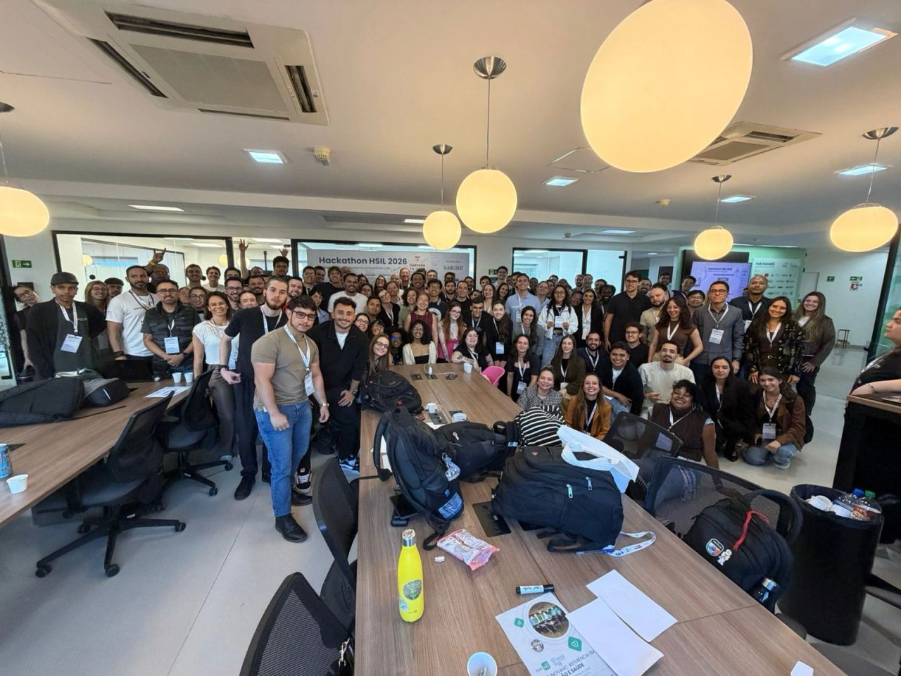
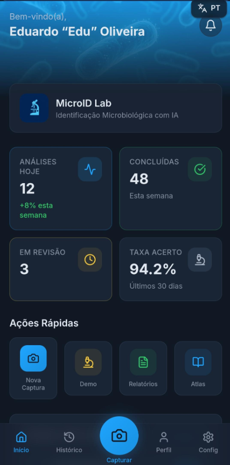

<div align="center">

# MicroID Lab

#### *Portable AI for microbiological diagnostics*

[](#recognition)
[](#recognition)
[](#how-it-works)
[](#purpose)

<br/>



</div>

---

## About

**MicroID Lab** is an AI-powered diagnostic platform that combines computer vision, clinical data, and epidemiological intelligence to support microbiological diagnostics in regions with limited infrastructure.

Built in Brazil. Designed for the world.

---

## Recognition

> 🏆 **Winner — HSIL Harvard 2026 Brazil**
>
> 🌍 **Top 93 Worldwide**
>
> 🤝 Competing against teams from **41 countries**

<div align="center">

&nbsp;&nbsp;

<sub>Award ceremony & MicroID Lab team at Hackathon HSIL 2026 — Harvard T.H. Chan School of Public Health</sub>

<br/><br/>



<sub>Hackathon HSIL 2026 — InovaHC, HCFMUSP</sub>

</div>

---

## How It Works

```
   📷                🧠                🩺                ✅
Image Capture  →  AI Analysis  →  Clinical Context  →  Diagnostic Support
```

The platform assists diagnostic workflows by analyzing microscopy images alongside epidemiological and clinical information — delivering decision support where laboratory infrastructure is scarce.

---

## Visual Showcase

<div align="center">



<sub>MicroID Lab — mobile diagnostic dashboard</sub>

</div>

---

## Technologies


---

## Purpose

> *Democratizing microbiological diagnostics through portable AI.*

---

## Contact

<div align="center">

[](https://github.com/)
[](https://linkedin.com/)
[](#)

<sub>© MicroID Lab — Made with care in Brazil 🇧🇷</sub>

</div>
